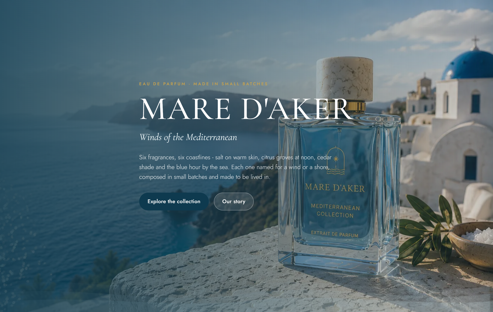
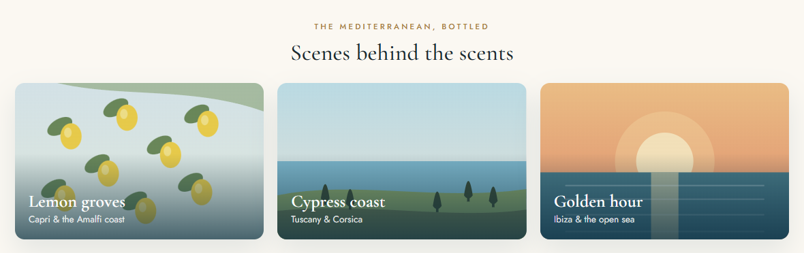
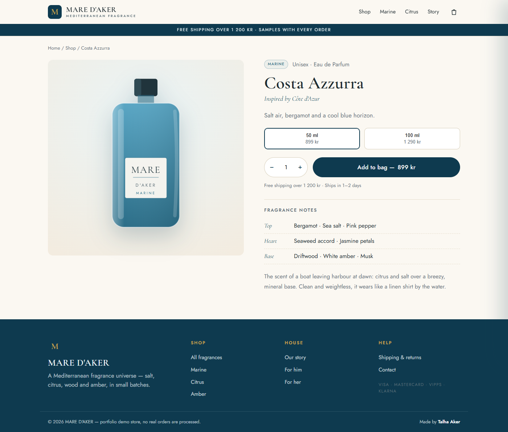
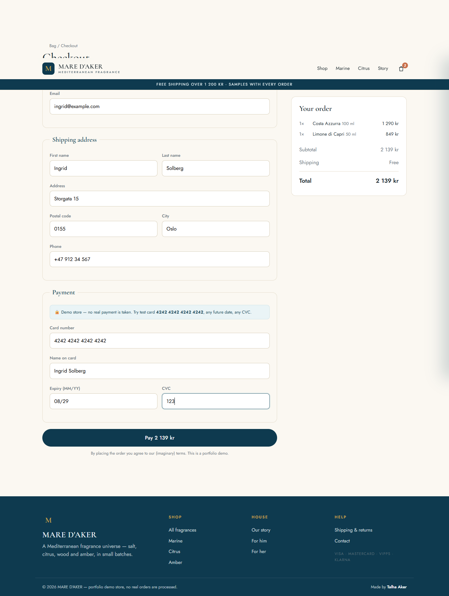

# 🌊 MARE D'AKER - A Mediterranean Fragrance Universe


A fully functional **perfume e-commerce storefront** for a fictional Mediterranean
fragrance brand - product catalogue, filtering and search, product pages, a cart, and
a complete **checkout flow** with form and card validation. Built from scratch in
**vanilla JavaScript** (no framework, no build step), so it runs anywhere you can host
static files.

**🛍️ Live demo:** https://t4lh8.github.io/MARE-D-AKER-A-Mediterranean-Fragrance-Online-Store/



> ⚠️ **Portfolio demo store - no real payment is processed.** The checkout accepts the
> test card `4242 4242 4242 4242` and validates it client-side only.

## Features

- **Product catalogue** - 12 fragrances, each with notes (top / heart / base), sizes and prices
- **Shop page** - filter by fragrance family and audience, sort by price / popularity / name, and live search
- **Product pages** - size selector, quantity, add-to-bag, fragrance notes and related scents
- **Cart** - slide-in cart drawer + full cart page, quantity steppers, remove, live totals, free-shipping threshold
- **Checkout** - contact, shipping and payment forms with inline validation (incl. a **Luhn card check** and expiry-date check), live order summary
- **Order confirmation** - generated order number and estimated delivery
- **Persistent cart** - survives reloads via `localStorage`
- **Design** - Mediterranean theme with animated hero waves and **hand-built SVG bottle art** tinted per fragrance family (no image files needed)
- **Responsive** and keyboard-accessible, with reduced-motion support

### Hand-built visuals

Every bottle and every scene is **generated SVG** - no stock photos, no image files. The Mediterranean mood (a low sun and headlands behind the hero, plus lemon groves, cypress coast and golden hour) is drawn entirely in code.



| Product page | Checkout |
|---|---|
|  |  |

## Tech

| | |
|---|---|
| **Frontend** | Vanilla JavaScript (ES2020), HTML5, CSS3 |
| **Routing** | Hash-based single-page router (`#/shop`, `#/product/:id`, `#/checkout` …) |
| **State** | Cart in `localStorage`, re-rendered via a small event bus (`cart:change`) |
| **Art** | Inline SVG - bottles and hero waves generated in code |
| **Hosting** | Static - no build, deploys straight to GitHub Pages |

## How it works

```
index.html         app shell: header, cart drawer, footer
css/style.css      the Mediterranean theme
js/data.js         brand copy + the fragrance catalogue (edit products here)
js/art.js          SVG bottle + hero-wave generators
js/store.js        cart state, localStorage, price helpers
js/views.js        one render function per page
js/app.js          hash router + all interactions (event delegation) + checkout validation
```

The cart never blocks the UI: adding an item updates `localStorage` and fires a
`cart:change` event, and the header badge, drawer and cart page re-read from the store.
Checkout runs fully client-side validation (required fields, email format, a real Luhn
check on the card number, and an expiry-date-in-the-future check) before creating the order.

## Run locally

No install or build needed:

```bash
git clone https://github.com/t4lh8/MARE-D-AKER-A-Mediterranean-Fragrance-Online-Store.git
cd MARE-D-AKER-A-Mediterranean-Fragrance-Online-Store
# then open index.html, or serve it:
python -m http.server 8000     # http://localhost:8000
```

## What I learned

- Structuring a **single-page app in vanilla JS** - a hash router, views and event delegation - without a framework
- Modelling an **e-commerce cart** and a validated **checkout flow** (including the Luhn algorithm for card numbers)
- Keeping UI in sync with a tiny **event-driven store** and `localStorage`
- Building a whole product catalogue's imagery as **generated SVG**, so the site needs zero image assets
- Designing a cohesive, responsive brand with an accessible, reduced-motion-friendly layout

## License

[MIT](LICENSE)

Made by **Talha Aker**.
